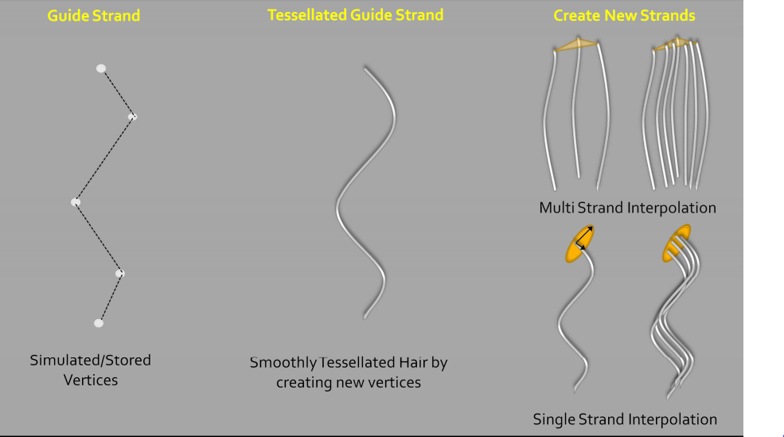
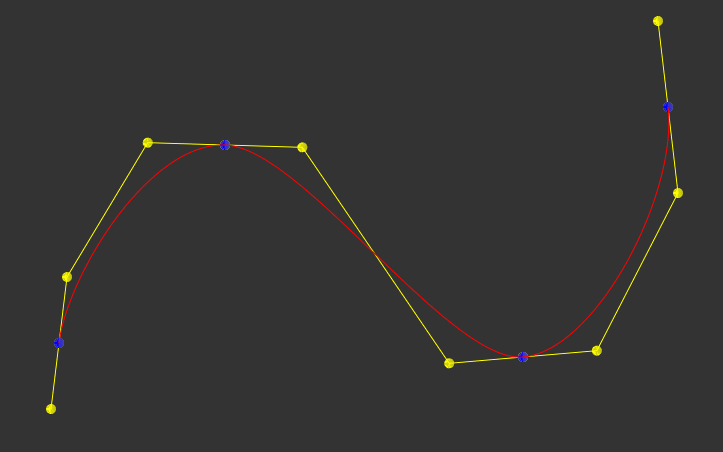
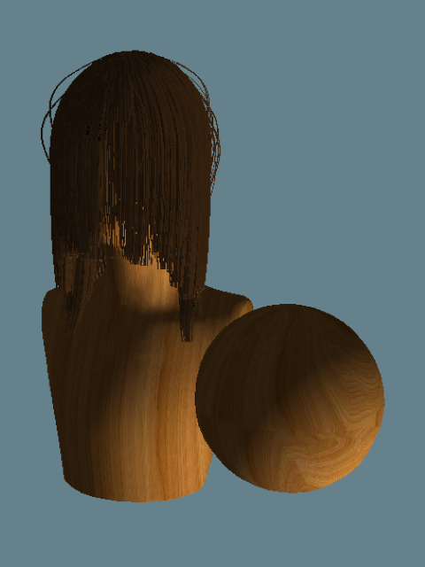
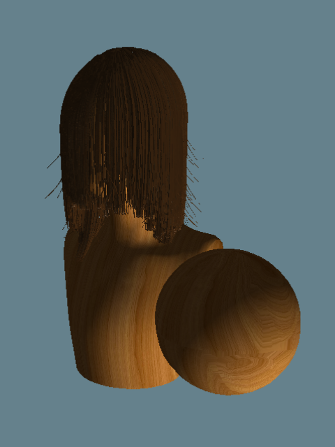
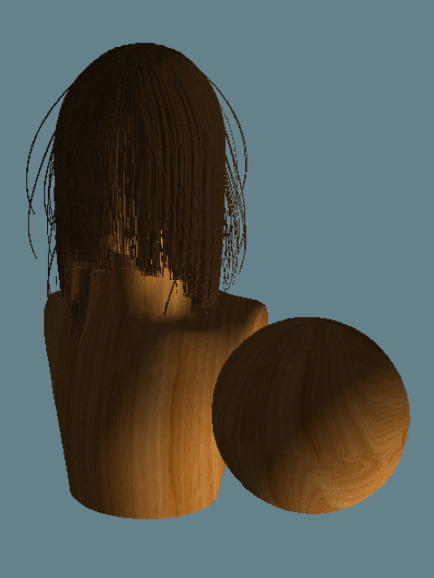

# Realtime Vulkan Hair
**University of Pennsylvania, CIS 565: GPU Programming and Architecture,
Final Project**

* Grace Gilbert: [LinkedIn](https://www.linkedin.com/in/grace-gilbert-2493a0156/), [personal website](http://gracelgilbert.com/)
* Caroline Lachanski: [LinkedIn](https://www.linkedin.com/in/caroline-lachanski/), [personal website](http://carolinelachanski.com/)

Tested on: TBD

# Overview
Simulating hair is an important challenge in computer graphics. A head of hair can contain approximately 1,000,000 strands of hair. These strands exhibit inextensible spring-like behavior, meaning their behavior is similar to a string of linked, very stiff springs. The many strands must interact with each other and external opbjects, as well as with light. Light is scattered through hair in a variety of ways, creating proper highlihts and shadows. To acheive 

We created a real-time hair simulation using Vulkan. Our pipeline simulates physics on a relatively small number of guide hairs, duplicates these guide hairs to increase the visual density of the hair, and then renders the strands with approximated physically based scattering. The user is able to interact with the hair in real time, moving a collision sphere throughout the head of hair. 


# Milestones
- [Pitch](presentations/ProjectPitch.pdf)
- [Milestone 1](presentations/Milestone1.pdf)
  - Set up project base
  - Follicle placement from sampling mesh
  - Physics simulation in compute shader (no collisions yet)
  - Bezier interpolation between strand curve points in tessellation shader
- [Milestone 2](presentations/Milestone2.pdf)
  - Hair-object collision
  - Single strand interpolation
  - Mesh loading and rendering
  - Begin hair-hair collision
- [Milestone 3](presentations/Milestone3.pdf)
  - Extended isolines into triangles with geometry shader
  - Begin single scattering rendering
  - Interactive collision sphere
- Final
  - Hair-hair collision
  - Complete single scattering
  - Shadow mapping
  - Multi scattering
  - Random strand deviations
  - Multiple strand interpolation
  - Polish
  
# Implementation
## Pipeline
We start by placing guide hair strands on the surface of the head geometry. Each strand is a string of individual points. In a compute shader, we simulate physics on the points of these guide strands. Then in the render process, we tessellate the input points of the strands. First we connect the strand points using Bezier interpolation between the points, to create a smooth, curved strand of hair. Next, also in the tessellation stage, we duplicate the guide strands to add density to the hair. After tessellation, the strands are isolines, 1D line segments. The strands are then passed through a geometry shader, which convertes the isolines into triangles. Finally, shading and lighting are applied in the fragment shader, and the hair is rendered to screen.



## Physics
To simulate the spring-like behavior of the hair strands, we use a Follow-the-Leader (FTL), Position Based Dynamics (PBD) approach. Each strand is split into many segments, each like little springs. Because hair does not stretch significantly, the springs are very stiff. To simulate very stiff springs using a more physically based mass-spring system would be very costly and inefficient. Instead, we apply FTL to ensure that the segments maintain their length. 

We start with the PBD technique of updating the point position according to its current position, velocity, and force. This is where any external forces, such as gravity and wind, get applied. The base point of each strand remains pinned to the head.

Next, we apply FTL as a constraint, moving the updated point position to the closest position that is the correct distance from the parent point on the strand. To do this, we find the direction of the point to its parent point (the adjacent point that is closer to the root of the strand). We move the point along this direction so that it is a predetermined distance away from the parent. This distance is the length of the strand divided by the number of segments.

Once we have the updated position of the point with the FTL constraint applied, we update the points current velocity. The simple method of taking the change in position over the change in time does not preserve an even mass distribution over the strand. Instead, we use the following calculation to determine the point's new velocity:


In this equation, i refers is the point we are currently updating and i + 1 refers to the point below it, farther from the root. d refers to the correction vector of the point, meaning the difference between its previous frame's position and its updated position. Because this velocity update requires correction vector of the point below, and we calculate position updates in order of root to tip, we perform this corrected velocity update after all points have had their position updated.

The following gif demonstrates what the hair dynamics look like with this simulation model applied. There are no additional constraints or collisions.


### Object Collision
Our approach for object collision is to apply a penalty force upon collision, rather than a preventative technique. This means that our simulation allows strands to enter into the surface of the collision geometry, but as soon as it does, it will get pushed out in the next frame. By making the collision geometry slightly larger than the rendered geometry, the slight collision into the geometry is rarely noticeable. 

When updating the position of a point on the strand, we first check if it is inside one of the collision ellipsoids. If it is, we apply a zero-length spring force to push the point out of the surface. This force is added to the external forces with gravity and any other external forces. The zero-length spring force acts as if there is a very stiff spring such that any distance away from the center of the spring gets penalized. This spring acts along the normal of the surface of the geometry at the point of collision. The force added is the following:

```
PenaltyForce = k * d * normal
```

k represents the spring stiffness, which we set to be very large. d is the depth of the point within the collision object, penalizing deeper collisions more strongly. The normal is the normal of the surface of the ellipsoid at the collision point.

A benefit of this penalty based technique is that it is very simple to apply and is very efficient. It is simple because it just involves updated the force used to update position before applying any constraints.  It is efficient because it does not require multiple iterations of constraint applications. If instead we were to apply collisions as a second constraint, we would have to perform multiple iterations of the position update so that both the FTL constraint and collision constraint are sufficiently satisfied. This would slow down the simulation, making it less suitable for a real time model. 

One downside of the penalty approach is that it is dependent on a small delta time. If there is too much time in between frames, the strands might travel fairly deep within a collision object. The penalty force to correct this collision could become very large, applying a strong force that could cause the simulation to explode and become unstable. However, out simulation is fast enough that the time between frames is low enough for penalty based collisions to work effectively.

The following gif demonstrates hair-object collision:


### Hair-Hair Interaction
To acheive friction between the strands of hair, we create a velocity field out of the strand's velocities and use this field to effectively smooth out the velocities over the strands.

When we first set the velocity of a point on a strand, we add that point's contribution to a background uniform grid, which is empty at the beginning of each timestep. We add both the density of the point and its velocity contribution to the 8 neighboring grid points. The contribution to each of the 8 points is based on a linaer interpolation of the distance in each dimension from the strand point to teh grid point:

```
For each of the 8 neighbor gridPoints:
  xWeight = 1 - abs(strandPoint.x - gridPoint.x)
  yWeight = 1 - abs(strandPoint.y - gridPoint.y)
  zWeight = 1 - abs(strandPoint.z - gridPoint.z)

  totalWeight = xWeight * yWeight * zWeight

  gridPoint.density += totalWeight
  gridPoint.velocity += totalWeight * strandPoint.velocity
```
Note that the strand point positions used in the above calculations are their world positions transformed into index grid space, where each grid cell is 1x1x1. Additionally, because multiple strand points may contribute to the same grid point, we must use atomic adds when adding to the grid point values.  

Once all of strand points have added their contributions to the grid, we transfer the grid data back to each of the strands using the same interpolation values for the surrounding 8 grid points:
```
velocityFromGrid = vec3(0)
For each of the 8 neighbor gridPoints:
  xWeight = 1 - abs(strandPoint.x - gridPoint.x)
  yWeight = 1 - abs(strandPoint.y - gridPoint.y)
  zWeight = 1 - abs(strandPoint.z - gridPoint.z)

  totalWeight = xWeight * yWeight * zWeight

  gridPointVelocity = gridPoint.velocity / gridPoint.density
  velocityFromGrid += totalWeight * gridPointVelocity
```
This velocity from grid value represents a smoothed out velocity among the nearby strands of hair. We do not want to set the new velocity directly to this grid velocity, as this will exhibit too much friction and damping. Instead, we have a friction parameter, in our case approximate 0.05, and calculate the final velocity as a mix between the original and the one found on the grid:
```
Friction = 0.05
velocity = (1 - friction) * velocity + friction * velocityFromGrid
```
This grid transfer process causes nearby strands of hair to move with more similar velocities. This mimics friction, as if two strands collide, they will stick together a little bit, meaning their velocities align. This friction causes natural hair clumping, as nearby strands tend to try to move together. You can also notice the friction as the hair falls on itself, cascading down slowly as it falls against other strands. This falling friction can be seen in the following two examples:

Side            |  Back         
:-------------------------:|:-------------------------:
| 

The friction also creates some volume for the hair. If many strands are being pushed towards other still strands, the small velocities of the still strands will gradually transfer over to the strands being pushed towards them, slow those strands down. Because of this gradual slow down, rather than continuing to fall directly on top of the still strands, the moving strands will slow to a stop earlier, creating volume as they rest on top of the still strands. 

The following image exemplifies this volume created by smoothing the velocities:


## Tessellation and Geometry Shader
The physics is only performed on individual points along each strand of hair. To have the points look like actual hair strands, we need to connect the points with smooth curves, duplicate the guide strands to add density, and convert the hairs from lines to 2D geometry.

### Bezier Curves
Each strand of hair is represented a a string of individual points. To create a smoothly curved hair strand, I interpolate between these points using a Bezier curve interpolation. The Bezier interpolation is performed on each segment of the curve. Each segment is given 4 control points which create a hull for the segment. Based on the distance along the segment, we interpolate between the control points to create a curve that fits the shape of the hull. The control point positions are determined based on the neighboring curve points of the current segment and are placed in such a way that ensures continuity between adjacent segment's curves. 

The following is an example of a Bezier curve (red) with its curve points (blue) and control points and hulls (yellow):



### Strand Interpolation
#### Single Strand
#### Multiple Strand
#### Random Strand Deviation
With just single strand and multiple strand interpolation alone, the hair has a very uniform, neat appearance. Realistically, however, individual strands of hair can deviate from the nearby hairs. To achieve this effect, when tessellating strands to duplicate the guide strands, we probabilistically choose to deviate the strands from their guide strand. 

With a probability of 0.5, a strand has some deviation. To get this probability, we choose use a deterministic random function to get a random number between 0 and 1 dependent on the guide strand position and the tessellation value that differentiates individual strands that are interpolated off of the guide strand. This gives each rendered strand a unique random number. If this random number is above 0.5, we apply a deviation. 

If a tessellation point on a hair is deviated, the distance that it gets pushed away from the guide strand is scaled up. This scale does not have to apply to the entire strand, but can vary along the length of the strand, so part of the strand can be more aligned with the guide hair, and other can be deviated to be further away.

There are 5 distributions of deviation, each occuring with equal probability. Some deviations use a guassian curve to adjust the tessellated strands. One gaussian curve is centered close to the root of the hair, causing stray, deviated hairs at the top of the head. Two other guassian curves cause more deviations towards the bottome of the strands, each with different scales of deviation. Other deviations follow an exponential curve based on the distance along the strand. One exponential deviation very sharply increases towards the tip of the hair, causing flyaway bits at the tips. Another exponential strand is a much more gradual exponential increase, causing almost the whole strand to be deviated.

The below images represent exaggerated versions of the three general deviation shapes (high and low guassian, sharp and gradual exponential):

High Gaussian            |  Low Gaussian         
:-------------------------:|:-------------------------:
| 

Sharp Exponential       |  Gradual Exponential          
:-------------------------:|:-------------------------:
| 

### Geometry Shader
## Rendering
### Single Scattering
### Shadow Mapping
### Multiple Scattering

# References
- Fast Simulation of Inextensible Hair and Fur (Müller, Kim, Chentanez)
- Volumetric methods for simulation and rendering of hair (Petrovic, Henne, Anderson)
- Position Based Dynamics (Müller, Heidelberger, Hennix, Ratcliff)
- CIS 563 Course Material (Chenfanfu Jiang)
- CIS 562 Course Material (Stephen Lane)
- Real-Time Hair Rendering, Master Thesis (Markus Rapp)

